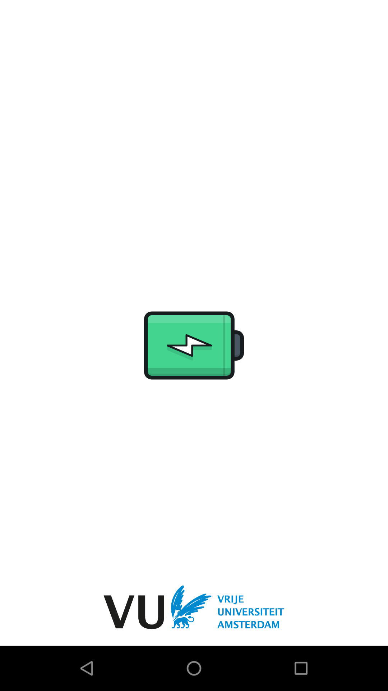
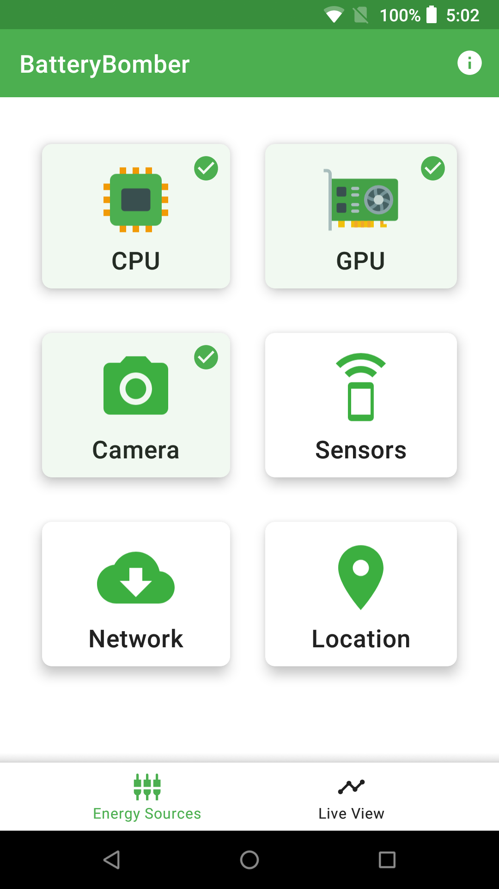

# BatteryBomber

|  |  |  |
| ---------------------------------------------- | -------------------------------------------- | ------------------------------------------- |

BatteryBomber is an android application aiming to drain the phone's battery as fast as possible. The idea is that every individual hardware component in a phone consumes an amount of power in order to function and consumes maximum power under maximum utilization. With this application we demonstrate the need for energy-efficient software and sustainable software engineering practices in battery-powered devices.

As of 2022, IT systems alone already consume 10% of global electricity and by 2030 it is estimated that, the Internet, data centers, telecommunication, and embedded devices will consume one third of the global energy demand. Renewable energy is only a half solution as to address the root causes we need green IT, to sustainably reduce the energy need of data centers and cloud services worldwide [1].

[[1]](https://ieeexplore.ieee.org/abstract/document/9585139) R. Verdecchia, P. Lago, C. Ebert and C. de Vries, "Green IT and Green Software," in IEEE Software, vol. 38, no. 6, pp. 7-15, Nov.-Dec. 2021, doi: 10.1109/MS.2021.3102254.

## Features

Currently BatteryBomber uses the following hardware features to drain the phone's batter:

* CPU - Threads doing expensive computations (SHA-512 hashes)
* GPU - Using [OpenGL ES 2.0](https://www.khronos.org/opengles/) to draw thousands of small rotating pyramids
* Camera - Using the [CameraX API](https://developer.android.com/training/camerax)
* Hardware sensors - Utilizes all of the device's available sensors (accelerometer, gyroscope, proximity, etc.) using the highest possible sampling rate.
* Network - Repeatedly downloads a large file over the network (WiFi or Cellular network)
* GPS chip - Using [precise location accuracy](https://developer.android.com/training/location/permissions#accuracy) 

## How to contribute

Simply clone this repository, prototype your idea, and finally create a pull request! Currently, the following features are missing:

* Baseband processor - Any way to make the baseband processor and Digital Signal Processor active
* Bluetooth - Use [bluetooth scanning](https://developer.android.com/guide/topics/connectivity/bluetooth/find-bluetooth-devices) as it is the most power consumptive operation (classic bluetooth and not BLE)
* Screen brightness
* Flashlight
