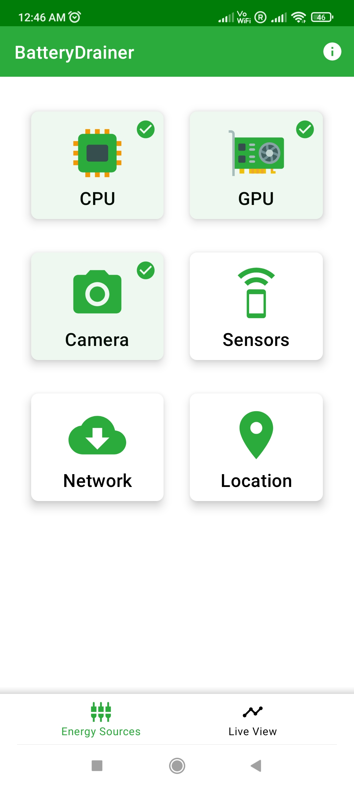
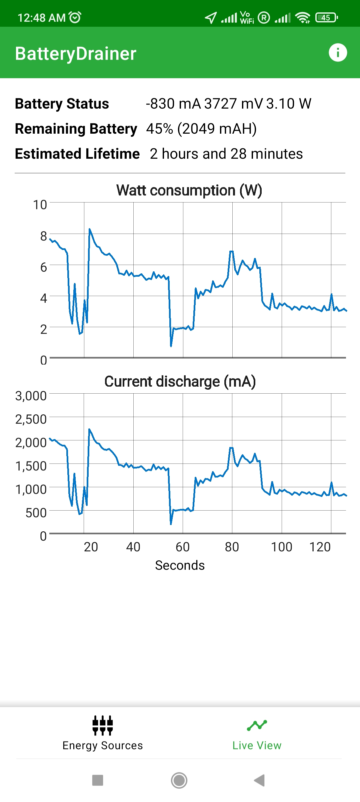

# BatteryDrainer

BatteryDrainer is an android app aiming to drain the phone's battery as fast as possible. 

***Why?*** With this application we demonstrate the need for energy-efficient software and sustainable software engineering practices in battery-powered devices, like phones or tablets. 

As of 2022, IT systems alone already consume 10% of global electricity and by 2030 it is estimated that, the Internet, data centers, telecommunication, and embedded devices will consume one third of the global energy demand. Renewable energy is only a half solution. To address the root causes we need green IT in order to sustainably reduce the energy need of data centers and cloud services worldwide [1].

[[1]](https://ieeexplore.ieee.org/abstract/document/9585139) R. Verdecchia, P. Lago, C. Ebert and C. de Vries, "Green IT and Green Software," in IEEE Software, vol. 38, no. 6, pp. 7-15, Nov.-Dec. 2021, doi: 10.1109/MS.2021.3102254.

|  |  |  |
| ---------------------------------------------- | -------------------------------------------- | ------------------------------------------- |

## Features :wrench:

Currently BatteryDrainer uses the following hardware features to drain the phone's batter:

* CPU - Threads doing expensive computations (SHA-512 hashes)
* GPU - Using [OpenGL ES 2.0](https://www.khronos.org/opengles/) to draw thousands of small rotating pyramids
* Camera - Using the [CameraX API](https://developer.android.com/training/camerax)
* Hardware sensors - Utilizes all of the device's available sensors (accelerometer, gyroscope, proximity, etc.) using the highest possible sampling rate.
* Network - Repeatedly downloads a large file over the network (WiFi or Cellular network)
* GPS chip - Using [precise location accuracy](https://developer.android.com/training/location/permissions#accuracy)

## How to contribute :rocket:

If you want to contribute, simply clone this repository, prototype your idea or bug fix, and finally create a pull request!

If you would like to implement a future feature, make sure to checkout [roadmap.md](roadmap.md).

## Contact :raising_hand:

This application has been developed by the [Software and Sustainability (S2) research group](https://s2group.cs.vu.nl/) of the Vrije Universiteit Amsterdam. For any questions regarding this app, you can reach out to us at [greenlab.vu@gmail.com](mailto:greenlab.vu@gmail.com).
